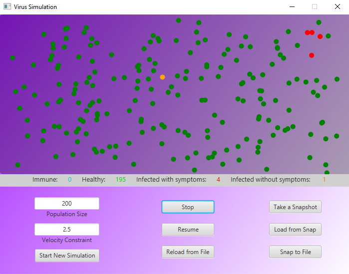

# Virus Simulation

## Contents

- Introduction
- Presentation
- Requirements
- Installation
- Troubleshooting
- Maintainers

## Introduction

Virus Simulation is an application visualizing spread of a virus. User can manipulate the size
of a population and can set maximum velocity each of simulated objects can move at.
The simulation always starts with 1 subject with symptoms and 1 subject without them, the rest of the population
is healthy. The direction and velocity of every subject is random, and can change at any given time during the simulation.
  

**The criteria for healthy subject getting infected by ill subject are:**
- Being inside the infection area of subject with virus: radius <= 2m (20px)
- Staying inside infection area continuously for 2s (50 cycles)

 

**Chances of getting infected after meeting above criteria by subject:**
- with symptoms is 100%
- with no symptoms is 50%, and after a failed attempt, the next one begins as if targeted healthy subject 
just entered infection area for the first time

 

**Every infected subject has a chance of gaining immunity to virus after being infected
for 20s, and that chance raises by 10% every 1s.**

## Presentation

## Requirements

- OpenJDK ver.21 or higher

## Installation

**Cloning Repository Steps:**
- Open your IntelliJ IDE
- Go to file/new/project_from_version_control
- Paste URL: https://github.com/Alex555eu/virus_simulation.git
- Clone repository
- Compile and run

## Troubleshooting

**Symptoms**
- 'Reload from File' button not working.

**Possible Causes**
- 'Reload from File' button restores the state of simulation created by pressing 
    'Snap to File' button. If 'Snap to File' button have never been pressed before, the application
    never had a chance to save any simulation state to the file the 'Reload from File' action would try to read from.

**Troubleshooting**
- Try pressing 'Snap to File' button, and then 'Reload from File' button. If this action is glitched, reload the 
    application and try again.

**Note:**
- This troubleshooting procedure also applies for 'Load from Snap' and 'Take a Snapshot' buttons.

## Maintainers

Current maintainers:
- Aleksander Pasich ([@github](https://github.com/Alex555eu))